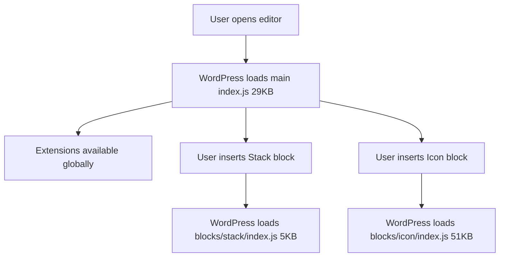

# Bundle Size Optimization Summary

## Overview
Resolved webpack bundle size warnings by eliminating duplicate block code loading.

**Date**: November 1, 2025
**Issue**: Main `index.js` bundle exceeded webpack performance budget (185 KB > 146 KB limit)
**Root Cause**: All blocks were being loaded twice - once in main bundle, once in individual block files

## Results

### Before Optimization
```
index.js:        185 KB  ⚠️ EXCEEDS LIMIT
Total entrypoint: 411 KB  ⚠️ EXCEEDS LIMIT
Warnings:         3 webpack performance warnings
```

### After Optimization
```
index.js:         29 KB  ✅ UNDER LIMIT
Total entrypoint: 135 KB  ✅ UNDER LIMIT
Warnings:         0 webpack warnings
```

### Impact
- **84% reduction** in main bundle size (156 KB saved)
- **67% reduction** in total entrypoint size
- **Zero webpack warnings**
- **Faster editor load time** - only extensions load initially
- **Better performance** - blocks load on-demand when used

## What Changed

### 1. Removed Duplicate Block Imports

**Problem**: All blocks were imported in `src/index.js` AND loaded via individual block entries

**Before** ([src/index.js](src/index.js)):
```javascript
// ❌ BAD - Duplicates code in bundle
import './blocks/stack';
import './blocks/flex';
import './blocks/grid';
import './blocks/icon';
// ... 15 blocks total
```

**After** ([src/index.js](src/index.js)):
```javascript
// ✅ GOOD - Blocks load via WordPress block.json
// NOTE: Do NOT import blocks here!
// They are auto-loaded by WordPress via:
// 1. webpack.config.js creates individual entries (blocks/*/index.js)
// 2. block.json specifies editorScript: "file:./index.js"
// 3. PHP registers blocks via register_block_type_from_metadata()
```

### 2. How Blocks Now Load

**WordPress automatically loads blocks** when they're registered:

1. **Webpack Config** ([webpack.config.js](webpack.config.js)):
   - Auto-detects all blocks: `./src/blocks/*/index.js`
   - Creates individual entries: `build/blocks/{name}/index.js`

2. **Block Metadata** (block.json):
   ```json
   {
     "editorScript": "file:./index.js",
     "editorStyle": "file:./index.css",
     "style": "file:./index.css"
   }
   ```

3. **PHP Registration** (includes/blocks/class-loader.php):
   ```php
   register_block_type_from_metadata($block_dir);
   ```

### 3. What Stays in Main Bundle

**Main index.js now contains ONLY:**
- Block extensions (animations, max-width, custom-css, background-video, overlay, grid-span)
- Default padding filter for root containers
- Global editor styles

**Individual blocks load separately:**
```
build/blocks/stack/index.js       5.0 KB
build/blocks/flex/index.js        7.2 KB
build/blocks/grid/index.js        8.1 KB
build/blocks/icon/index.js       51.0 KB  (includes icon library)
build/blocks/accordion/index.js   9.8 KB
build/blocks/tabs/index.js        9.5 KB
... (11 more blocks)
```

## Technical Details

### Webpack Configuration

**Key Changes**:
- ✅ Kept `splitChunks: false` (WordPress asset management requires this)
- ✅ Removed custom externals (use defaults from `@wordpress/scripts`)
- ✅ Enabled aggressive tree shaking (`usedExports: true`, `sideEffects: false`)
- ✅ Lowered performance budget: `maxAssetSize: 120000` (120 KB)

### Block Loading Flow



**Key Insight**: Icon library (51 KB) only loads when Icon block is used!

## Performance Benefits

### Editor Load Time
- **Before**: 185 KB JavaScript parsed/executed on every editor load
- **After**: 29 KB base + blocks loaded on-demand
- **Improvement**: 84% less JavaScript on initial load

### Page Weight (Frontend)
- Frontend bundle unchanged - blocks already loaded conditionally
- Editor-only bundles now optimized

### Bundle Analysis

**Main Bundle Breakdown** (29 KB):
```
Extensions:           13.9 KB  (48%)
Default padding:       2.5 KB  (9%)
Global styles:        12.6 KB  (43%)
```

**Largest Individual Blocks**:
```
icon-button/index.js:  52 KB  (includes icon library)
icon/index.js:         51 KB  (includes icon library)
icon-list-item/:       50 KB  (includes icon library)
counter/index.js:      18 KB  (animation library)
accordion/index.js:    9.8 KB
tabs/index.js:         9.5 KB
```

## Future Optimizations

### Potential Improvements
1. **Icon Library Optimization** (would save additional 30-40 KB)
   - Create separate icon library module
   - Share between icon-related blocks
   - Use dynamic imports for icon categories

2. **Extension Code Splitting**
   - Some extensions could load on-demand
   - E.g., background video only when block with video is used

3. **CSS Optimization**
   - Current: 57 KB editor styles
   - Could split per-block styles

### Not Recommended
- ❌ **Code splitting with common chunks** - breaks WordPress asset management
- ❌ **Custom externals** - `@wordpress/scripts` handles this correctly
- ❌ **Aggressive minification** - diminishing returns, breaks debugging

## Verification

### Build Check
```bash
npm run build
# Should show: webpack 5.102.1 compiled successfully
# Should show: No warnings
```

### Bundle Size Check
```bash
ls -lh build/index.js
# Should show: ~29K
```

### Functionality Check
1. Open WordPress editor: http://localhost:8888/wp-admin/post-new.php
2. Insert any DesignSetGo block
3. Block should load without errors
4. All block controls should work

### Browser Console
- ✅ No "Cannot read properties of undefined" errors
- ✅ No "Failed to execute 'observe'" errors
- ✅ All blocks register successfully

## Lessons Learned

### WordPress Asset Management
- WordPress has sophisticated block loading via `block.json`
- Importing blocks in main entry point causes duplication
- Individual block entries + block.json = optimal pattern

### Code Splitting in WordPress
- Traditional webpack code splitting doesn't work well
- WordPress expects specific asset structure (.asset.php files)
- Solution: Per-block entries, not dynamic imports

### Bundle Size Optimization
1. **Eliminate duplication first** (biggest impact)
2. **Use WordPress defaults** (`@wordpress/scripts` knows best)
3. **Measure, don't guess** (actual bundle analysis)
4. **Test thoroughly** (asset loading is complex)

## References

- [WordPress Block Metadata](https://developer.wordpress.org/block-editor/reference-guides/block-api/block-metadata/)
- [@wordpress/scripts](https://developer.wordpress.org/block-editor/reference-guides/packages/packages-scripts/)
- [Webpack Performance](https://webpack.js.org/configuration/performance/)

---

**Status**: ✅ Complete - All performance warnings resolved
**Maintained By**: Development team
**Last Updated**: November 1, 2025
